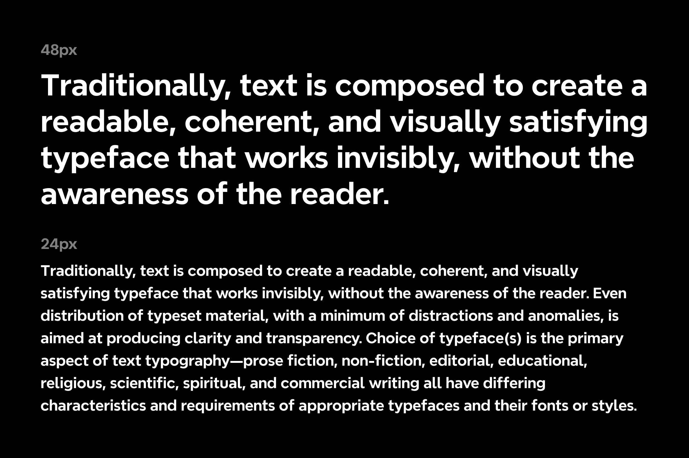
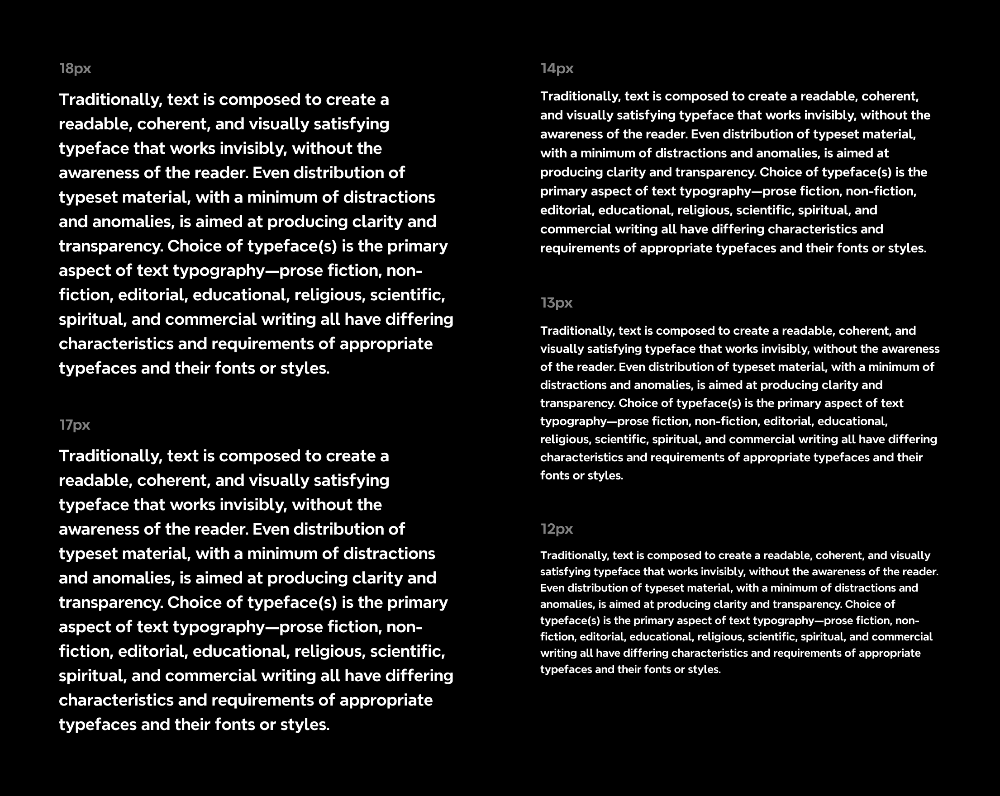

## About Nevermind

Nevermind is Xmind's signature typeface, derived from the Xmind logo design. This modern font combines geometric and
humanist styles, offering both professionalism and approachability for various design applications. The font family
comes in 9 weights (100-900) and supports 109 languages, including German, French, Greek, Russian, and more.

Available font styles
Weight | class
--- | ---
Thin | 100
ExtraLight | 200
Light | 300
Regular | 400
Medium | 500
DemiBold | 600
Bold | 700
Extrabold | 800
Black | 900

## License

This Font Software is licensed under the SIL Open Font License, Version 1.1.
This license is available with a FAQ at [https://openfontlicense.org](https://openfontlicense.org)
